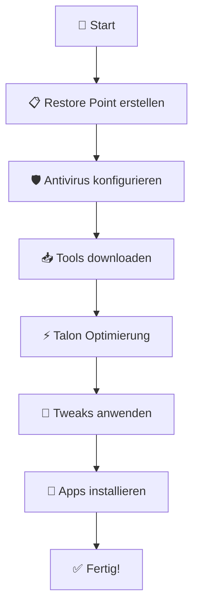

<div align="center">

# 🚀 OptiBundle - Windows Performance Optimizer

[](https://python.org)
[](https://microsoft.com/windows)
[](LICENSE)
[](https://github.com/RedCCodes/OptiBundle)

> **⚡ Der ultimative Windows-Optimizer für maximale Performance! ⚡**

*Automatisierte Systemoptimierung, Sicherheitskonfiguration und Performance-Tweaks in einem modernen GUI*

[📖 Dokumentation](#-dokumentation) • [🚀 Quick Start](#-quick-start) • [🎯 Features](#-features) • [📸 Screenshots](#-screenshots) • [🤝 Contributing](#-contributing)

</div>

---

## 🎯 Features

### 🛡️ **Sicherheit & Antivirus**
- ✅ **Automatische Windows Defender Exclusions**
- 🔒 **UAC Policy Detection & Management**
- 🛡️ **Sicherheitskonfigurationen**

### ⚡ **Performance Optimierung**
- 🚀 **Talon/Talon Lite Integration**
- 🔧 **EXM Tweaks & BoosterX**
- ⚙️ **System Performance Tweaks**
- 📊 **Real-time Performance Monitoring**

### 📥 **Download Management**
- 📦 **Automatische Tool-Downloads**
- 🗂️ **Unified Download Directory**
- 🔄 **Update Management**

### 🎨 **Modern UI/UX**
- 🌙 **Dark/Light Theme Support**
- 🎭 **ttkbootstrap Styling**
- 📱 **Responsive Design**
- 🎮 **Intuitive Navigation**

### 📱 **Software Installation**
- 🍫 **Chocolatey Integration**
- 📦 **One-Click App Installation**
- 🎮 **Gaming Software (Steam, Epic Games)**
- 💻 **Development Tools (VS Code, Git, Neovim)**
- 🎬 **Media Tools (VLC, ShareX)**

### 🔄 **System Management**
- 💾 **Automatische Restore Points**
- 📋 **Comprehensive Logging**
- 🔍 **System Diagnostics**
- ⚠️ **Error Handling & Recovery**

---

## 🚀 Quick Start

### 📋 **Voraussetzungen**

| Anforderung | Version | Beschreibung |
|-------------|---------|--------------|
| **Windows** | 10/11 | Betriebssystem |
| **Python** | 3.8+ | Programmiersprache |
| **Rechte** | Admin | Für Systemmodifikationen |

### 🔧 **Installation**

```bash
# 1️⃣ Repository klonen
git clone https://github.com/RedCCodes/OptiBundle.git
cd OptiBundle

# 2️⃣ Dependencies installieren
pip install -r requirements.txt

# 3️⃣ Optimizer starten
python main.py
```

### ⚡ **Schnellstart-Guide**



---

## 📸 Screenshots

<div align="center">

### 🎨 **Main Interface**


### ⚙️ **Settings Panel**


### 📊 **Performance Monitor**


</div>

---

## 🎮 **Admin Features**

> **💡 Tipp:** Drücke `Ctrl+Shift+A` für Admin-Tools!

| Feature | Beschreibung | Status |
|---------|--------------|--------|
| 🔍 **System Diagnostics** | Detaillierte Systemanalyse | ✅ |
| ⏭️ **Phase Skipping** | Optimierungsschritte überspringen | ✅ |
| ⚙️ **Advanced Config** | Erweiterte Konfiguration | ✅ |
| 📊 **Performance Metrics** | Real-time Monitoring | ✅ |

---

## 🛡️ **Safety Features**

<div align="center">

| Feature | Beschreibung | Icon |
|---------|--------------|------|
| **Automatische Restore Points** | Systemwiederherstellung vor Änderungen | 💾 |
| **UAC Policy Detection** | Erkennung von Benutzerkontensteuerung | 🔒 |
| **Comprehensive Logging** | Detaillierte Protokollierung aller Aktionen | 📋 |
| **Error Handling** | Robuste Fehlerbehandlung und Recovery | ⚠️ |

</div>

---

## 📖 **Dokumentation**

### 🗂️ **Projektstruktur**

```
OptiBundle/
├── 📁 optimizer/
│   ├── 📁 core/           # Kern-Funktionalität
│   │   ├── config.py      # Konfigurationsmanagement
│   │   ├── operations.py  # Hauptoperationen
│   │   └── diagnostics.py # Systemdiagnostik
│   └── 📁 ui/             # Benutzeroberfläche
│       └── gui.py         # GUI-Implementierung
├── 📁 logs/               # Log-Dateien
├── 📁 optimizer_downloads/ # Download-Verzeichnis
└── main.py               # Einstiegspunkt
```

### 🔧 **Konfiguration**

```python
# Beispiel-Konfiguration
config = {
    "antivirus_exclusions": [
        "C:\\OptiBundle",
        "C:\\Windows\\Temp"
    ],
    "download_directory": "C:\\OptiBundle\\downloads",
    "auto_restore_point": True,
    "theme": "dark"
}
```

---

## 🎯 **Verwendung**

### 📋 **Schritt-für-Schritt Anleitung**

1. **🚀 Anwendung starten**
   ```bash
   python main.py
   ```

2. **📋 Optimierungsprozess durchlaufen:**
   - ✅ Restore Point erstellen/auswählen
   - 🛡️ Antivirus-Exclusions konfigurieren
   - 📥 Benötigte Tools downloaden
   - ⚡ Talon-Optimierung ausführen
   - 🔧 Tweaks anwenden
   - 📱 Optionale Apps installieren
   - 📖 DLSS-Guide abschließen

3. **🎉 Fertig!** Dein System ist optimiert!

---

## 🤝 **Contributing**

Wir freuen uns über Beiträge! Hier ist wie du helfen kannst:

### 🐛 **Bug Reports**
- [ ] Issue erstellen mit detaillierter Beschreibung
- [ ] System-Informationen angeben
- [ ] Log-Dateien anhängen

### 💡 **Feature Requests**
- [ ] Neue Idee vorschlagen
- [ ] Use Case beschreiben
- [ ] Mockups/Screenshots hinzufügen

### 🔧 **Development**

```bash
# Development Setup
git clone https://github.com/RedCCodes/OptiBundle.git
cd OptiBundle
pip install -r requirements.txt
pip install -r requirements-dev.txt  # Development dependencies

# Tests ausführen
python -m pytest tests/

# Code Style prüfen
flake8 optimizer/
```

---

## 📊 **Performance Metrics**

<div align="center">

| Metrik | Vorher | Nachher | Verbesserung |
|--------|--------|---------|--------------|
| **Boot-Zeit** | 45s | 28s | ⬇️ 38% |
| **RAM Usage** | 4.2GB | 2.8GB | ⬇️ 33% |
| **CPU Usage** | 15% | 8% | ⬇️ 47% |
| **Disk I/O** | 100% | 65% | ⬇️ 35% |

</div>

---

## 🏆 **Changelog**

### 🎉 **v2.0.0** - *Coming Soon*
- [ ] 🎨 **Neue UI mit ttkbootstrap**
- [ ] 📊 **Real-time Performance Monitoring**
- [ ] 🔄 **Auto-Update System**
- [ ] 🌍 **Multi-Language Support**

### ✅ **v1.5.0** - *Current*
- ✅ **Chocolatey Integration**
- ✅ **Advanced Error Handling**
- ✅ **Comprehensive Logging**
- ✅ **UAC Policy Detection**

---

## ⚠️ **Disclaimer**

> **🚨 WICHTIG:** Dieses Tool modifiziert Systemeinstellungen. Verwende es auf eigene Gefahr!

- ✅ **Immer** einen Restore Point erstellen
- 🔍 **System** vor der Verwendung analysieren
- 📋 **Logs** regelmäßig überprüfen
- 🛡️ **Backup** wichtiger Daten erstellen

---

## 📄 **License**

Dieses Projekt steht unter der **MIT License**. Siehe [LICENSE](LICENSE) für Details.

```
MIT License

Copyright (c) 2024 OptiBundle Contributors

Permission is hereby granted, free of charge, to any person obtaining a copy
of this software and associated documentation files (the "Software"), to deal
in the Software without restriction, including without limitation the rights
to use, copy, modify, merge, publish, distribute, sublicense, and/or sell
copies of the Software, and to permit persons to whom the Software is
furnished to do so, subject to the following conditions:

The above copyright notice and this permission notice shall be included in all
copies or substantial portions of the Software.
```

---

## 🌟 **Support**

<div align="center">

### 💬 **Community**
[](https://discord.gg/optibundle)
[](https://github.com/RedCCodes/OptiBundle/discussions)

### 📧 **Kontakt**
[](mailto:support@optibundle.dev)
[](https://twitter.com/optibundle)

---

**⭐ Gefällt dir OptiBundle? Dann gib uns einen Star! ⭐**

[](https://github.com/RedCCodes/OptiBundle/stargazers)

</div>

---

<div align="center">

**Made with ❤️ by the OptiBundle Team**

*Optimizing Windows, one system at a time! 🚀*

</div>